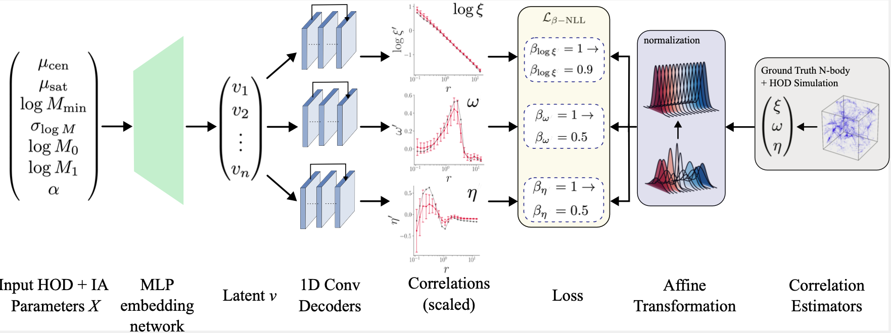

# IAEmu: Learning Galaxy Intrinsic Alignment Correlations

## IAEmu

This code supplements the expirements conducted in [2504.05235](https://arxiv.org/abs/2504.05235), IAEmu: Learning Galaxy Intrinsic Alignment Correlations. We develop a neural network based emulator that predicts galaxy intrinsic alignment statistics (position-position, position-orientation, and orientation-orientation correlation functions) from an underlying HOD from [Halotools](https://github.com/astropy/halotools)-IA. The model weights and dataset can all be found on our Zenodo page. 

IAEmu features an embedding network coupled with three 1D convolutional decoders. It was trained under a multi-task learning framework for a mean-variance estimation task. IAEmu is also structured to output epistemic uncertainties via Monte Carlo Dropout. The overall design of the architecture and its training procedure is designed to predict correlation functions of varying magnitudes and signal-to-noise.

## Scripts

`src/scripts/dataset.py` contains PyTorch datasets for loading the Halotools-IA data. This dataset class normalizes all the correlation functions as part of the training procedure. The methods `inverse_transform()` and `inverse_mc_variance()` allows the rescaling of 1) IAEmu outputs (means and aleatoric uncertainties) and 2) appropriate scaling of the epistemic uncertainties retrieved from Monte Carlo Dropout.

`src/scripts/get_predictions.py` contains a wrapper class to retrieve individual preductions from IAEmu. It requires the model weights, as well as access to the train and test dataset (for calculating the inverse scaling).

`src/scripts/hmc.py` is an implementation of Hamiltonian Monte Carlo with IAEmu using Pyro. The set of parameters was what was used for the experiments in our paper. Dropout must be left *off* when using IAEmu with HMC.

`src/scripts/model.py` defines the IAEmu architecture.

`src/scripts/train.py` contains the training code for IAEmu.

`src/scripts/test.py` contains the testing code for IAEmu. It also has functionality for Monte Carlo Dropout by taking in a `--mc_passes` argument. The `--scale` argument specifies if the correlations should be scaled back to the original domain. All results presented in the paper were in the original data domain.

`src/scripts/utils.py` contains a variety of helper functions.
